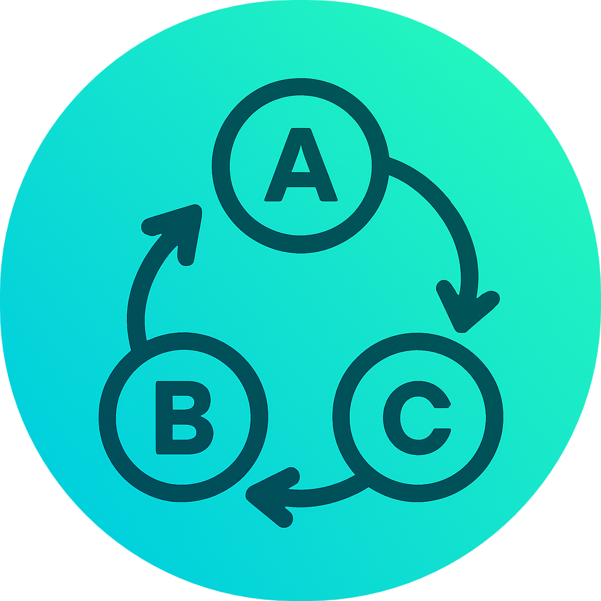

<p align="center">
  
</p>

<h1 align="center">
  Finite-State-Machine Studio
</h1>

  A **Qt-based finite state machine (FSM) editor, visualizer, and simulator**.

  FSM Studio is a GUI application implemented in **C++/Qt** that lets you **create, visualize, and simulate Moore-based state machines**.

---

## 👥 Authors

* [Patrik Procházka](https://github.com/ppatrik-dev)
* [Miroslav Bašista](https://github.com/Mirek321)
* [Filip Ficka](Aresgornos)

---

## 🖥 Program Description

FSM Studio provides an intuitive graphical interface for building Moore machines.

**Key functionalities:**

* Create automata via GUI
* Add states and transitions
* Assign unique functionality to each state
* Configure transition conditions in the **Information Panel**

Each automaton can have:

* Name & description
* Inputs & outputs
* Variables

Transition conditions use a **JavaScript-like syntax**. The `moore` helper object allows access to timers and runtime helpers.

---

## ⚡ Supported Transition Operators

| Operator | Description           |
| -------- | --------------------- |
| `=`      | Assignment            |
| `==`     | Equality              |
| `!=`     | Inequality            |
| `>=`     | Greater than or equal |
| `<=`     | Less than or equal    |
| `>`      | Greater than          |
| `<`      | Less than             |
| `&&`     | Logical AND           |
| `\|\|`   | Logical OR            |

### ⏱ Timed Transitions

For timed transitions, use:

```javascript
moore.timer(ms)
```

* Waits `ms` milliseconds before proceeding
* Must return a boolean (`true` or `false`)

---

## 🌟 Features

* Visual FSM editor (states & transitions)
* Simulation/terminal widget for input/output observation
* Export/import automata as `.json`
* Multiple execution strategies (run/step)
* Example automata for testing & learning

---

## 📂 Repository Structure

```
src/          — application source (GUI + parser/executor)
  ├─ gui/     — Qt GUI sources (mainwindow, scene, widgets, resources)
  └─ parser/  — parsing, machine, execution logic
examples/     — example JSON automata
doc/          — documentation and diagrams (class-diagram.pdf)
build/        — build artifacts
```

---

## 🛠 Requirements

1. Unix-like environment (developed on Ubuntu)
2. Qt 6 development libraries & standard build tools

---

## ⚙ Setup

**Build from source:**

```bash
# Build the binary
make build

# Run the application
./build/fsm-studio

# Or build & run in one step
make run
```

**Install to system:**

```bash
# Then search for FSM Studio app
make install
```

---

## 🖱 Usage

1. Launch the program (`./build/fsm-studio` or `make run`)
2. Build your automaton using the GUI
   * Add states, transitions, conditions, variables and inputs
3. Click  to run the automaton in the terminal widget
4. Observe the visualization and outputs.

---

## 📄 Example

To run `MorseEATM.json`:

1. Build and run the application
2. Import the automaton:

   * `Import` button in the toolbar
   * Navigate to `examples/intermediate/MorseEATM.json`
3. GUI populates the automaton and details panel
4. Press `Simulate` to run the automaton

---

## 📝 Makefile Commands

| Command            | Description                    |
| ------------------ | ------------------------------ |
| `make build`       | Compile the program            |
| `make run`         | Compile & run                  |
| `make install`     | Install the application        |
| `make uninstall`   | Uninstall the application      |
| `make html`        | Generate HTML documentation    |
| `make clean-build` | Delete generated build files   |
| `make clean-html`  | Delete generated documentation |
| `make clean`       | Delete all generated files     |

---

## 📂 Running with Examples

Load and simulate automata from `examples/` (simple, intermediate, advanced).

---

## 📚 Documentation

* UML/Class diagram: `doc/class-diagram.pdf`

Generate HTML API docs (Doxygen will be installed):

```bash
make html
```

---

## 🧪 Tests

No automated tests provided. Tested on example automata.

---

## 📜 License

Licensed under **MIT License** — see `LICENSE` for details.
